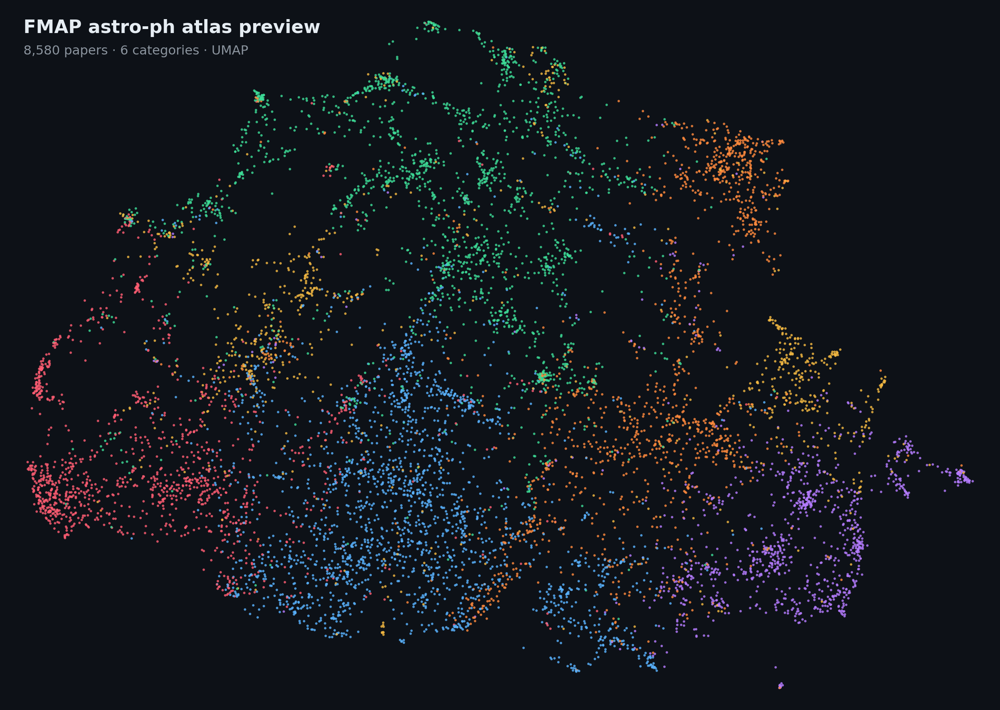

# FMAP: FindMyArxivPaper

**FMAP: FindMyArxivPaper** started as a local paper-atlas project for astrophysics and arXiv exploration.

It combines:
- **real arXiv ingestion**
- **text classification** over astro-ph categories
- **semantic embeddings** for similarity and retrieval
- a **generated interactive HTML atlas** for browsing papers as a map

FMAP is now evolving into a second, more research-heavy track:

## FMAP-RAG Lab

**FMAP-RAG Lab** is the new astrophysics-first research direction inside this same repository.
It extends FMAP from atlas-style exploration into **citation-faithful question answering over scientific papers**.

The long-term goal is not to build a generic chatbot over papers. The goal is to study:
- dense retrieval over scientific text
- reranking and late-interaction-inspired retrieval
- flat vs section-aware or hierarchical retrieval
- citation-grounded answer generation
- retrieval quality, answer correctness, citation precision, and factual support

This repository therefore now has **two connected tracks**:

1. **FMAP Atlas**
   - arXiv ingestion
   - semantic search
   - category classification
   - UMAP-based interactive paper map

2. **FMAP-RAG Lab**
   - astrophysics QA benchmark scaffolding
   - chunk/evidence-oriented scientific retrieval
   - citation-faithful answer generation
   - research-style evaluation for retrieval and factuality

The project name remains **FMAP: FindMyArxivPaper**.
**FMAP-RAG Lab** is the new flagship research track growing from the same foundation.

---

<div align="center">
  <div style="background:#0d1117; border:1px solid #30363d; border-radius:16px; padding:20px; display:inline-block; max-width:1100px;">
    
    <p style="margin:14px 8px 2px; color:#c9d1d9; font-size:14px; line-height:1.65; text-align:left;">
      UMAP preview of the current full FMAP atlas: 46k+ astro-ph papers embedded from titles and abstracts, coloured by category and prepared for interactive exploration in the generated HTML atlas.
    </p>
  </div>
</div>

Tracked site snapshot in the repo:
- [HTML entry point](docs/site/index.html)
- [Data payload](docs/site/data.js)

Important note:
- GitHub will happily store these files, but it will **not automatically serve the HTML snapshot as a live interactive app** unless you use GitHub Pages or another static host.
- So in the README, the image is the reliable preview.
- The tracked HTML is useful as a repo artifact, downloadable snapshot, and source reference.

---

## What FMAP currently does

FMAP can:
- ingest paper metadata from CSV
- fetch real papers from the **arXiv export API**
- focus on **astro-ph** categories by default
- fetch either a **recent slice** or a **historical year range**
- build embeddings from **title + abstract**
- train a classifier to predict astro-ph categories
- evaluate both classification and retrieval quality
- generate plots, including **year distribution**
- generate a **static interactive HTML site** with a dense paper map

This makes it much closer to a real paper-atlas / portfolio project than a toy classifier demo.

---

## What FMAP-RAG Lab will add

The new research track is being built incrementally.

### Week 1 milestone
Week 1 focuses on **research scaffolding rather than model complexity**:
- benchmark scaffold for astrophysics QA
- processed-data schema for future chunk/evidence retrieval
- reading list tying the project to concrete retrieval/RAG/factuality papers
- repository refactor direction for the upcoming retrieval and QA work

See:
- [Week 1 roadmap](docs/roadmaps/fmap-rag-lab-week1.md)
- [Astrophysics QA benchmark scaffold](benchmarks/astrophysics_qa/README.md)
- [Reading list](docs/references/fmap-rag-reading-list.md)
- [Processed-data layout](data/processed/README.md)
- [Source layout scaffold](src/fmap/README.md)

### Planned next steps
After the week-1 scaffold, the next implementation milestones are:
1. build a small astrophysics benchmark corpus
2. extract section-aware or full-text scientific chunks
3. compare lexical and dense retrieval baselines
4. add reranking
5. add citation-grounded answer generation
6. evaluate retrieval, answer quality, citation precision, and factual support

---

## Modeling roadmap: FMAP Atlas v1 and v2

FMAP already has two classification tracks.

### v1: classic baseline classifier

This is the original simple classifier.

- **Input text:** `title + abstract`
- **Vectorization:** TF-IDF with unigram + bigram features
- **Classifier:** `LinearSVC`

Why keep it:
- fast
- strong baseline
- easy to explain
- easy to iterate on while changing datasets

This is still the default model path.

### v2: deep learning classifier

This is the PyTorch-based classifier.

- **Framework:** PyTorch + Hugging Face Transformers
- **Default backbone:** `allenai/scibert_scivocab_uncased`
- **Training style:** full supervised fine-tuning for category classification
- **Input text:** `title + abstract`

Why this is useful:
- much more expressive than TF-IDF
- better suited to domain language and contextual phrasing
- a more serious NLP model for real arXiv data
- cleaner path toward future experiments such as larger encoders, class weighting, contrastive objectives, or retrieval-aware training

In other words:
- **v1** = lightweight baseline
- **v2** = transformer fine-tuning path

---

## Current modeling split

FMAP uses the data in **two different ways**.

### 1. Supervised classifier

This is the model used to predict the paper category.

You can now choose either:
- **v1:** TF-IDF + `LinearSVC`
- **v2:** transformer fine-tuning with PyTorch

This is what produces:
- accuracy
- macro F1
- confusion matrix

### 2. Embeddings for similarity and mapping

This is separate from the classifier.

- **Embedding model:** `sentence-transformers/all-MiniLM-L6-v2`
- **Input text:** `title + abstract`

Used for:
- semantic search
- retrieval evaluation
- nearest-neighbor recommendations
- 2D map projection for the interactive site

So the split is:
- **classifier** = v1 baseline or v2 transformer
- **map / retrieval / recommendations** = sentence embeddings

---

## How train/test splitting works

FMAP does a normal supervised split before training the classifier:

- **75% training**
- **25% test**

This comes from `TEST_SIZE = 0.25` in `config.py`.

It also tries to **stratify by category**, so category balance is preserved when possible.

Examples:
- 5,000 papers → 3,750 train / 1,250 test
- 8,580 papers → 6,435 train / 2,145 test
- 10,000 papers → 7,500 train / 2,500 test

Important:
- the **classifier** is trained only on the training split
- the **map** is built from **all loaded papers**, not just the test set

So if you want a denser map, the main lever is to **load more papers overall**.

---

## Real arXiv support

FMAP fetches real metadata directly from the arXiv export API.

### Default astro-ph focus

By default it targets these categories:
- `astro-ph.GA`
- `astro-ph.SR`
- `astro-ph.HE`
- `astro-ph.CO`
- `astro-ph.EP`
- `astro-ph.IM`

For each paper, FMAP stores fields such as:
- title
- abstract
- category
- authors
- published date
- updated date
- arXiv URL

Fetched data is written to:
- `data/raw/arxiv_astro_ph_papers.csv`

### Current fetch behavior

The fetcher is deliberately cautious:
- batched requests
- retry / backoff on timeouts and rate limits
- deduplication by arXiv URL
- cached fallback if a previous CSV already exists
- filtering to retained `astro-ph.*` records only

### Recent-tail vs historical range

A plain query like:

```bash
python3 main.py --source arxiv --max-results 5000
```

will usually behave like a **recent-tail fetch**, because the export API is sorted by newest submissions.

That means you may mostly see the newest years unless you explicitly fetch by year range.

To expand historical coverage, FMAP now supports:
- `--from-year`
- `--to-year`

Example:

```bash
python3 main.py --source arxiv --max-results 10000 --from-year 2020 --to-year 2026
```

That makes FMAP fetch **year-by-year** across the range, merge the results, dedupe them, and stop when either:
- the requested count is reached, or
- the maximum available results in that range have been collected

---

## Progress reporting during fetch

When fetching from arXiv, FMAP now prints progress information such as:
- target astro-ph papers requested
- current year window being fetched
- raw rows fetched per batch
- astro-ph rows kept
- non-astro rows skipped
- duplicates skipped
- retained running total
- final message when only the maximum available rows can be returned

So output like this:

```text
Requested 15000 astro-ph papers, but only 8580 were available from arXiv for this query range. Using the maximum available.
```

means:
- FMAP asked for 15,000 retained astro-ph papers
- but the chosen query / year range / API results only yielded 8,580 unique retained rows
- so it saved the maximum available set instead of silently stopping short

---

## Interactive web atlas

FMAP generates a static website at:
- `outputs/site/index.html`

The site currently includes:
- dark atlas-style layout
- black background with a cooler cyan / mint / violet accent palette
- category-colored points
- search over title / abstract / author / category
- category filter chips
- result list tied to current filters
- click-to-lock paper details
- hover previews
- hover-time vector-neighborhood highlighting
- recommended nearby papers with approximate match percentages
- zoom and pan controls

It is a local/static visualization, so you can open the generated HTML directly in a browser.

---

## Why the map now uses UMAP

Earlier versions used **PCA** for the 2D projection.

That worked, but PCA often makes a paper map feel:
- too flat
- too spread out
- not locally structured enough

FMAP now uses **UMAP** instead.

### What UMAP is doing here

UMAP takes the high-dimensional embedding vectors and projects them into 2D while trying to preserve **local neighborhood structure** better than PCA.

That matters because this site is supposed to feel like an atlas:
- nearby points should often feel semantically related
- clusters should be tighter and more readable
- the map should look denser and more natural

### Current UMAP settings

From `config.py`:
- `UMAP_N_NEIGHBORS = 12`
- `UMAP_MIN_DIST = 0.08`
- `UMAP_RANDOM_STATE = 42`

Rough intuition:
- **lower `min_dist`** → tighter, denser clusters
- **lower `n_neighbors`** → more local structure
- **higher `n_neighbors`** → smoother, more global structure

So if you want an even denser atlas later, the easiest knob is often:
- lower `UMAP_MIN_DIST` a bit further, e.g. `0.03`

### Important note

UMAP is used for the **2D visualization only**.
It is **not** the classifier.

---

## Synthetic datasets

For demo/testing, FMAP still includes:
- `data/raw/papers.csv` — larger synthetic dataset
- `data/raw/papers_perfect.csv` — intentionally overly separable synthetic dataset

Use these when you want to test the pipeline without hitting arXiv.

A good v2 workflow is:
1. run on `papers_perfect.csv`
2. confirm the deep model trains and evaluates cleanly
3. move on to real arXiv data

---

## Plots and outputs

After running the pipeline, FMAP writes outputs such as:

- `outputs/models/` — trained classifier artifacts
- `outputs/metrics/` — evaluation metrics
- `outputs/figures/label_distribution.png` — category counts
- `outputs/figures/year_distribution.png` — published year counts
- `outputs/figures/embedding_projection.png` — 2D UMAP projection plot
- `outputs/figures/confusion_matrix.png` — classifier confusion matrix
- `outputs/site/` — interactive HTML atlas

### Model artifacts

Typical saved outputs now look like:
- `outputs/models/paper_classifier.joblib` — v1 baseline model
- `outputs/models/paper_classifier_v2/` — v2 transformer checkpoint, tokenizer, labels, and metadata

### Year distribution plot

The published-year plot is especially useful when checking whether your dataset is:
- only a recent slice
- or genuinely spread across older years

That plot is written to:
- `outputs/figures/year_distribution.png`

---

## Repository structure

```text
FindMyArxivPaper/
├── README.md
├── requirements.txt
├── main.py
├── config.py
├── data.py
├── arxiv_data.py
├── site_builder.py
├── models.py
├── train.py
├── evaluate.py
├── plots.py
├── search.py
├── demo.py
├── benchmarks/
│   └── astrophysics_qa/
│       ├── README.md
│       └── questions.seed.json
├── docs/
│   ├── references/
│   │   └── fmap-rag-reading-list.md
│   └── roadmaps/
│       └── fmap-rag-lab-week1.md
├── src/
│   └── fmap/
│       └── README.md
├── data/
│   ├── raw/
│   │   ├── papers.csv
│   │   ├── papers_perfect.csv
│   │   └── arxiv_astro_ph_papers.csv
│   └── processed/
│       └── README.md
└── outputs/
    ├── figures/
    ├── metrics/
    ├── models/
    └── site/
        ├── index.html
        └── data.js
```

---

## Quickstart

### 1. Set up environment

```bash
python3 -m venv .venv
source .venv/bin/activate
pip install -r requirements.txt
```

### 2. Run v1 on synthetic data

```bash
python3 main.py --source synthetic --model-version v1
```

### 3. Run v1 on the perfect synthetic dataset

```bash
python3 main.py --source perfect --model-version v1
```

### 4. Run v2 deep learning on the perfect synthetic dataset

```bash
python3 main.py --source perfect --model-version v2 --epochs 3
```

### 5. Run v2 deep learning on a recent astro-ph slice

```bash
python3 main.py --source arxiv --model-version v2 --max-results 5000 --epochs 3
```

### 6. Fetch a historical year range

```bash
python3 main.py --source arxiv --max-results 10000 --from-year 2020 --to-year 2026
```

### 7. Fetch custom arXiv categories

```bash
python3 main.py --source arxiv --max-results 800 --categories "astro-ph.GA,astro-ph.CO,astro-ph.HE,astro-ph.IM"
```

### 8. Re-run from a cached CSV

```bash
python3 main.py --source csv --input data/raw/arxiv_astro_ph_papers.csv
```

### 9. Use a different transformer backbone for v2

```bash
python3 main.py --source perfect --model-version v2 --transformer-model distilbert-base-uncased --epochs 2
```

### 10. Open the generated website

After running the pipeline, open:

```text
outputs/site/index.html
```

---

## Example use cases

### Build a local historical astro-ph atlas

```bash
python3 main.py --source arxiv --max-results 15000 --from-year 2020 --to-year 2026
open outputs/site/index.html
```

### Build a denser atlas from more recent papers

```bash
python3 main.py --source arxiv --max-results 10000
open outputs/site/index.html
```

### Compare v1 and v2 on the perfect dataset

```bash
python3 main.py --source perfect --model-version v1 --skip-site
python3 main.py --source perfect --model-version v2 --epochs 3 --skip-site
```

### Run semantic search on a chosen dataset

```bash
python3 demo.py --query "galaxy evolution and stellar populations" --input data/raw/arxiv_astro_ph_papers.csv
```

---

## Main files explained

### `arxiv_data.py`
Handles:
- arXiv API queries
- astro-ph category selection
- year-range queries
- progress reporting
- filtering retained astro-ph rows
- deduplication
- parsing Atom XML into structured rows

### `models.py`
Handles:
- sentence-transformer embeddings for retrieval/map building
- v1 baseline classifier definition
- v2 transformer classifier wrapper

### `train.py`
Handles:
- v1 baseline training and persistence
- v2 PyTorch fine-tuning loop and persistence

### `site_builder.py`
Handles:
- 2D UMAP projection for the site map
- point/color payload generation
- recommendation payloads
- writing the static HTML atlas

### `data.py`
Handles:
- synthetic dataset generation
- CSV loading
- preprocessing
- combined text creation
- train/test splitting

### `main.py`
Orchestrates the full workflow:
1. choose data source
2. optionally fetch arXiv data
3. preprocess text
4. build embeddings
5. train v1 or v2 classifier
6. evaluate metrics
7. generate plots
8. generate the interactive site

---

## What is new in v2

The deep-learning track adds:
- PyTorch-based text classification
- transformer fine-tuning with SciBERT by default
- checkpoint-style saving for the deep model
- CLI switches for versioned modeling experiments
- a clean baseline-vs-deep split in the project story

That makes FMAP feel less like a pure classical-ML demo and more like a real experimental NLP project.

---

## Why this is useful

FMAP is now a stronger long-form project because it combines:
- real data ingestion
- NLP embeddings
- baseline and deep text classification
- retrieval
- interactive visualization
- reproducible outputs
- a research-facing roadmap toward citation-faithful scientific QA

The existing atlas and classifier work already make the repository useful and demoable.
The new FMAP-RAG Lab track is what will turn it into a more serious retrieval / grounded-generation / evaluation project built on astrophysics papers rather than a generic RAG app.
